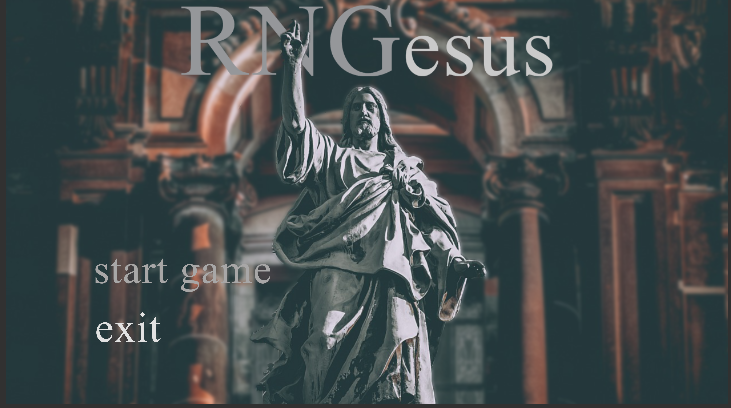
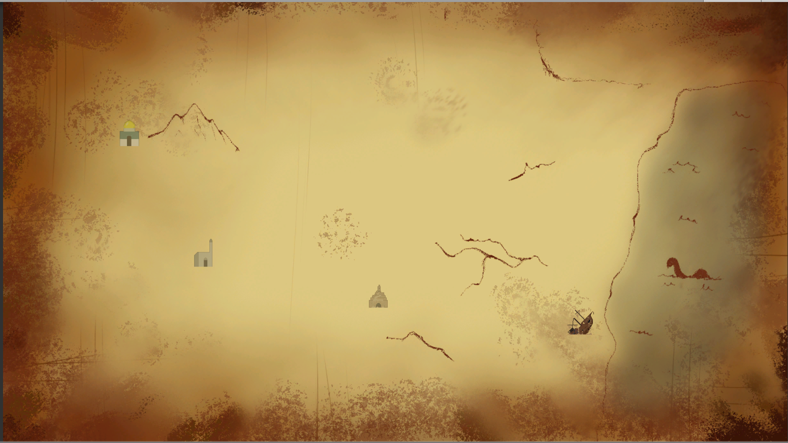
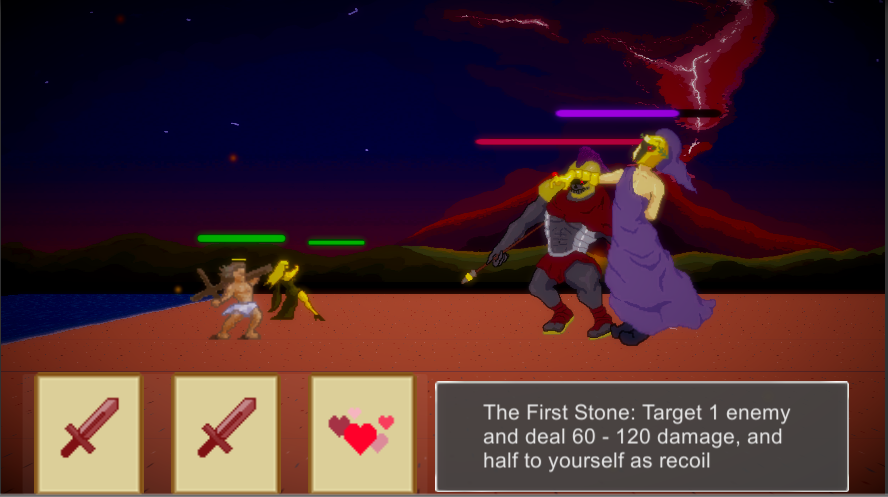
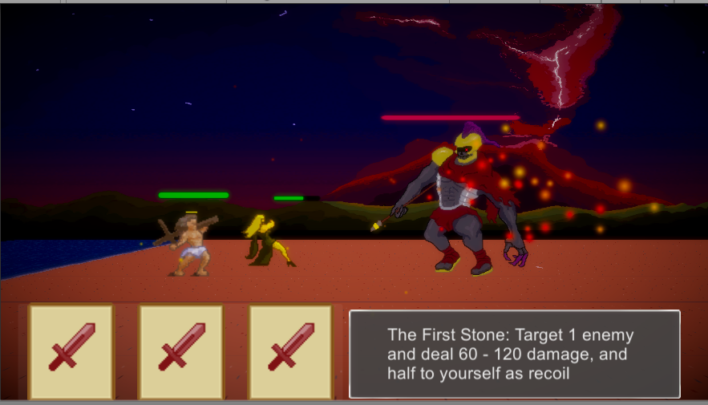
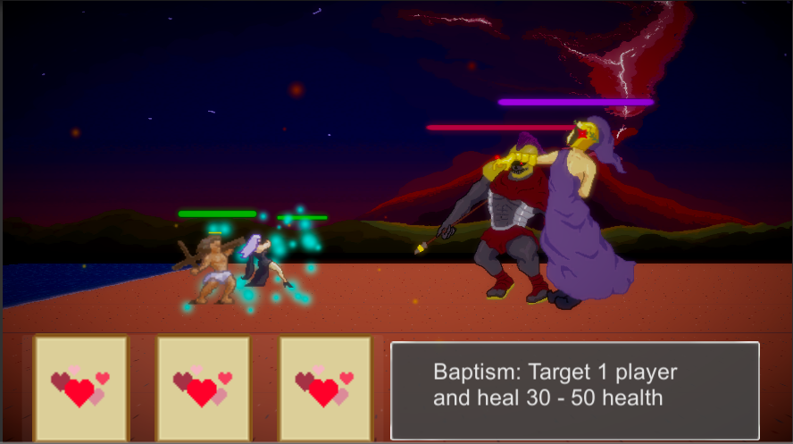

# RNGesus
Rogue-like video game project that implements RNG elements through its use of a card battle system. Draw from a deck of cards with various effects and fight your way through each level.

Title Screen: 

Overworld(1st level unlocked):

Card selection:

Movement and death:

Different cards add layer of depth to gameplay:

